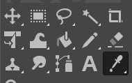

# Creating a track map file

## Introduction

1. Open the map with GIMP with output a .pgm file for the map
2. Open the .png file in GIMP and draw the map

Pick the colors with the color picker tool and use the pencil tool to draw the map.

Do not leave any unambiguous areas in the map. The map should be a closed loop. and all areas not part of the track should be black and the track should be white.

Do not do this: 

Do this: 

## Mark the start and finish line

Draw a line from the start to the finish line in a different color (red). This line should be 1 pixel wide.

- Using the Path Tool (Most Precise)
    1. Select the Paths Tool (shortcut: B).
    2. Click to set the first point.
    3. Click again to set the second point.
    4. Press Enter to confirm the path.
    5. Go to Edit > Stroke Path, choose the stroke style (e.g., pencil, brush), and click Stroke.